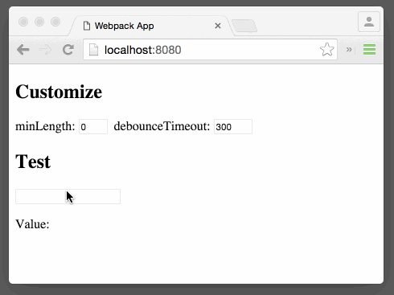

# react-debounce-input [](https://www.npmjs.com/package/react-debounce-input)

[](https://gitter.im/nkbt/help)

[](https://circleci.com/gh/nkbt/react-debounce-input)
[](https://david-dm.org/nkbt/react-debounce-input)
[](https://david-dm.org/nkbt/react-debounce-input#info=devDependencies)

React component that renders an Input, Textarea or other element with debounced onChange.
Can be used as drop-in replacement for `<input type="text" />` or `<textarea />`





## Installation

### NPM

```sh
npm install --save react react-debounce-input
```

Don't forget to manually install peer dependencies (`react`) if you use npm@3.


### 1998 Script Tag:
```html
<script src="https://unpkg.com/react@16.0.0/umd/react.production.min.js"></script>
<script src="https://unpkg.com/react-debounce-input/build/react-debounce-input.js"></script>
(Module exposed as `DebounceInput`)
```


## Demo

[http://nkbt.github.io/react-debounce-input](http://nkbt.github.io/react-debounce-input)

## Codepen demo

[http://codepen.io/nkbt/pen/VvmzLQ](http://codepen.io/nkbt/pen/VvmzLQ?editors=0010)

## Usage
```js
import React from 'react';
import ReactDOM from 'react-dom';
import {DebounceInput} from 'react-debounce-input';

class App extends React.Component {
  state = {
    value: ''
  };

  render() {
    return (
      <div>
        <DebounceInput
          minLength={2}
          debounceTimeout={300}
          onChange={event => this.setState({value: event.target.value})} />

        <p>Value: {this.state.value}</p>
      </div>
    );
  }
}

const appRoot = document.createElement('div');
document.body.appendChild(appRoot);
ReactDOM.render(<App />, appRoot);
```

## Options

#### `element` : PropTypes.string or React.PropTypes.func (default: "input")

You can specify element="textarea". For Example:

```js
<DebounceInput element="textarea" />
```

Will result in

```js
<textarea />
```

Note: when rendering a `<textarea />` you may wish to set `forceNotifyByEnter = {false}` so the user can make new lines without forcing notification of the current value.

This package has only been tested with `<input />` and `<textarea />` but should work with any element which has `value` and `onChange` props.

You can also use a custom react component as the element. For Example:

```js
<DebounceInput element={CustomReactComponent} />
```

Will result in

```js
<CustomReactComponent />
```

#### `onChange`: PropTypes.func.isRequired

Function called when value is changed (debounced) with original event passed through


#### `value`: PropTypes.string

Value of the Input box. Can be omitted, so component works as usual non-controlled input.


#### `minLength`: PropTypes.number (default: 2)

Minimal length of text to start notify, if value becomes shorter then `minLength` (after removing some characters), there will be a notification with empty value `''`.


#### `debounceTimeout`: PropTypes.number (default: 100)

Notification debounce timeout in ms. If set to `-1`, disables automatic notification completely. Notification will only happen by pressing `Enter` then.


#### `forceNotifyByEnter`: PropTypes.bool (default: true)

Notification of current value will be sent immediately by hitting `Enter` key. Enabled by-default. Notification value follows the same rule as with debounced notification, so if Length is less, then `minLength` - empty value `''` will be sent back.

*NOTE* if `onKeyDown` callback prop was present, it will be still invoked transparently.

#### `forceNotifyOnBlur`: PropTypes.bool (default: true)

Same as `forceNotifyByEnter`, but notification will be sent when focus leaves the input field.

#### Arbitrary props will be transferred to rendered `<input>`

```js
<DebounceInput
  type="number"
  onChange={event => this.setState({value: event.target.value})}
  placeholder="Name"
  className="user-name" />
```

Will result in

```js
<input
  type="number"
  placeholder="Name"
  className="user-name" />
```

## Development and testing

Currently is being developed and tested with the latest stable `Node 8` on `OSX`.

To run example covering all `DebounceInput` features, use `yarn start`, which will compile `example/Example.js`

```bash
git clone git@github.com:nkbt/react-debounce-input.git
cd react-debounce-input
yarn install
yarn start

# then
open http://localhost:8080
```

## Tests

```bash
# to run ESLint check
yarn lint

# to run tests
yarn test

# to run end-to-end tests
# first, run `selenium/standalone-firefox:3.4.0` docker image
docker run -p 4444:4444 selenium/standalone-firefox:3.4.0
# then run test
yarn e2e
```

## License

MIT
